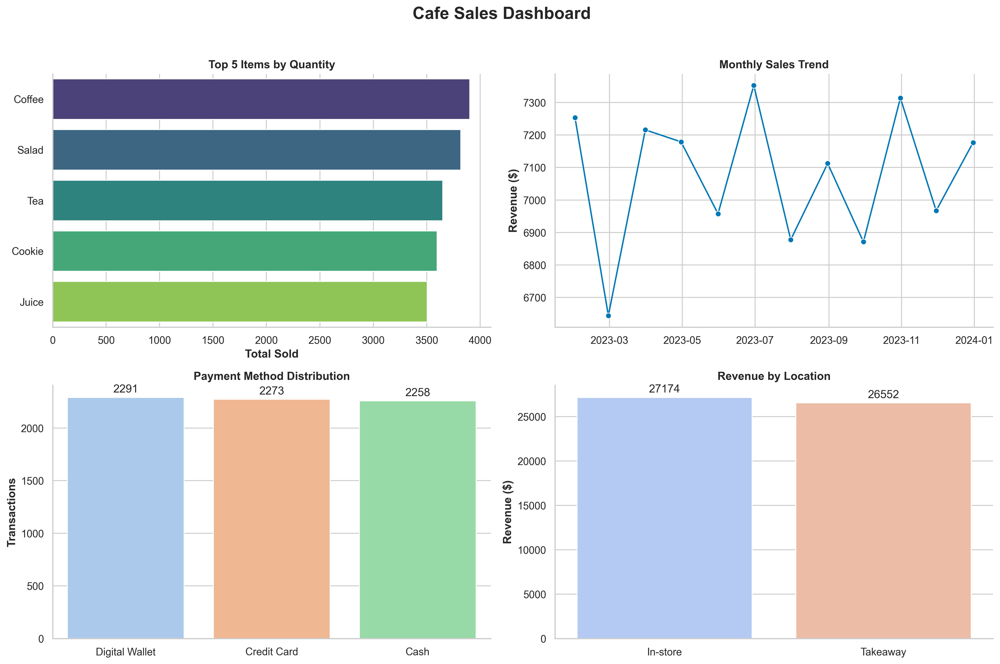

# ☕ Cafe Sales Analysis

This project takes a **messy cafe sales dataset** and transforms it into a clean, business-ready dataset.  
I then run an **Exploratory Data Analysis (EDA)** to uncover insights about sales, revenue, and customer behavior.

---

## 🧹 Data Cleaning
- Handled missing values in `Price Per Unit`, `Quantity`, and `Total Spent`.
- Resolved ambiguous prices (e.g., Sandwich vs Smoothie).
- Standardized item names and dropped dirty placeholders (`ERROR`, `UNKNOWN` → NA).
- Ensured consistency: `Quantity * Price Per Unit = Total Spent`.

---

## 📊 Exploratory Analysis
Key business insights:
- **Top-selling items:** Coffee dominates by quantity, but high-value items like Salad bring more revenue.
- **Revenue trend:** Monthly sales show clear seasonal patterns.
- **Payment methods:** Customers prefer Digital Wallets over Cash.
- **Location analysis:** In-store generates more revenue than takeaway.

---

## 📈 Dashboard
A snapshot of the business at a glance:

---

## 🔧 Tools Used
- Python (pandas, numpy)
- Seaborn & Matplotlib (data visualization)
- Jupyter Notebook

---

## 🚀 Next Steps
- Basket analysis (which items are frequently bought together)
- Customer segmentation using RFM analysis
- Building a predictive model for sales trends
